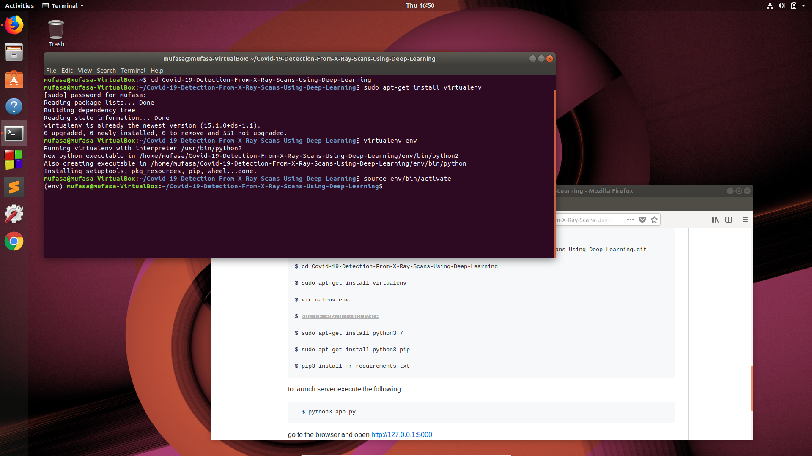
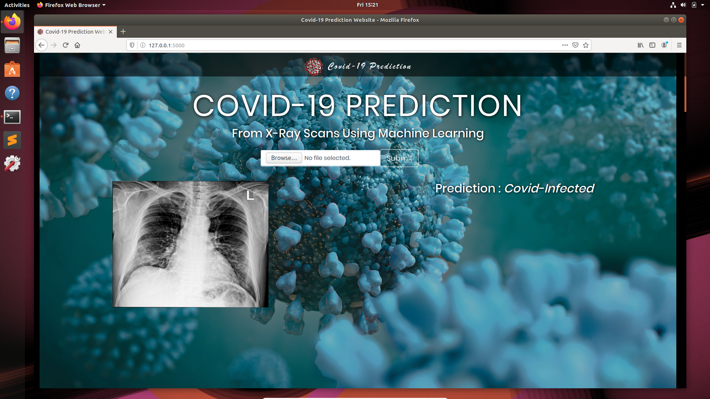

# Covid-19-Detection-From-X-Ray-Scans-Using-Deep-Learning

This Covid-19 Prediction Model is based on Convolutional Neural Network, a class of deep neural networks most commonly applied to analyzing visual imagery.

The model is able to predict covid-19 with an accuracy of 96%.

WEBSITE LINK: https://covid-19-detection-from-x-ray.herokuapp.com

## Installation Documentation

    $ sudo apt install git

    $ git clone https://github.com/ShobhitBansal/Covid-19-Detection-From-X-Ray-Scans-Using-Deep-Learning.git
    

  
    $ cd Covid-19-Detection-From-X-Ray-Scans-Using-Deep-Learning

    $ sudo apt-get install virtualenv

    $ virtualenv env

    $ source env/bin/activate
    

    
    $ sudo apt-get install python3.7
    
    $ sudo apt-get install python3-pip

    $ pip3 install -r requirements.txt
    

    
to launch server execute the following

	  $ python3 app.py
	  

    
go to the browser and open http://127.0.0.1:5000

 
## Website Demo
 
Upload the X-ray Scan which needs to be tested for Covid-19 and Click on the Submit button to generate the prediction.

